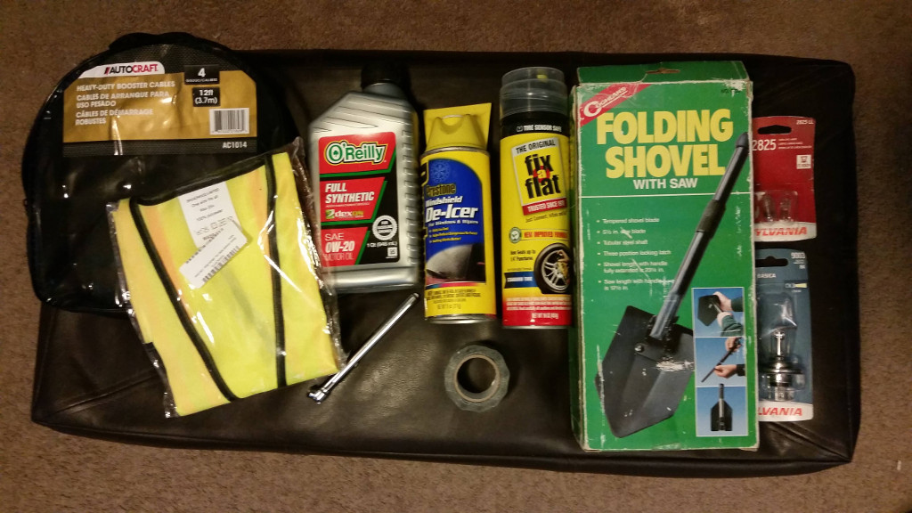

# Roadside Emergency Kit

Here's the current roadside kit contents:

* jumper cables
* safety vest
* extra engine oil
* tire pressure guage
* windshield de-icer
* emergency tire inflator/leak-seal
* duct tape
* camping shovel
* spare bulbs (headlight, interior)

Missing, but recommended:

* extra engine coolant/anti-freeze
* extra windshield washer fluid
* safety flares and/or reflectors
* flashlight

Specifically for winter:

* hand warmers
* blanket
* cat litter
* windshield de-icer (above)
* camping shovel (above)

